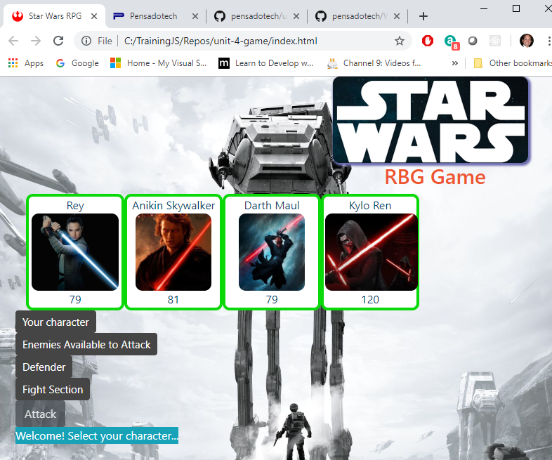
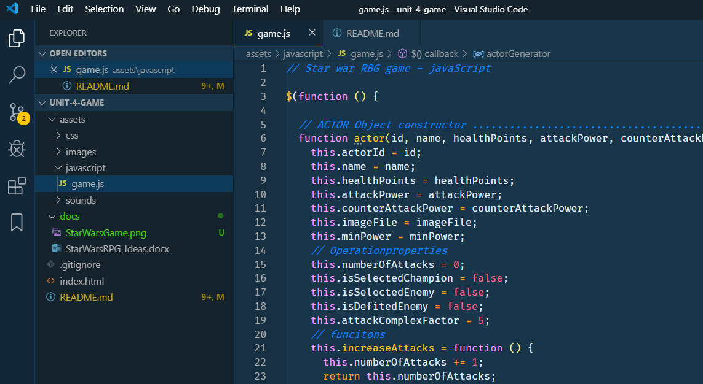

# Start Wars RPC game

Four start wars character face each other in combat.

_By Armando Pensado_

## Description

This project is a simple combat game that includes four start wars characters. Each time the game is started, the characters receive at random a power level and health level.  The user must choose one of the four characters (main character) and confront in battle the remaining ones (Defender). 

In every combat the main character will be affected, loosing health points at random. In order to win the game, the main character need to survive and defeat all of the three defender characters. 

The player will choose one opponent at a time, and use the attack button multiple times until the opponent is eliminated or the man character perish in combat.

## Who can benefit from this application

This project is a good example for beginner web developers that are learning HTML, CSS, and JQuery. 

## How developers can get started

The developer is welcome to clone or download the project to the personal device. The project can be executed in any browser, and can be visualized using MS Visual code. 

There is not specials initialization instructions, as it is plain HTML, CSS, and JQuery. 

The developer will find a game.js file that contains the core of the functionality. In there, the **'game'** object represents the game, and it uses the **actorGenerator** object to set teh four characters.

The bottom section has the events for controlling the user input and process teh selections.  

After cloning the application and using Microsoft Visual Studio, the project folder should resemble as depicted below.

## Who maintains and contributes to the project

This is a project for my personal learning process.

## Project references

* JQuery : https://jquery.com/
* w3schools JQuery tutotials : https://www.w3schools.com/jquery/default.asp
* w3schools HTML tutorials : https://www.w3schools.com/html/default.asp
* w3schools CSS tutorials : https://www.w3schools.com/css/default.asp